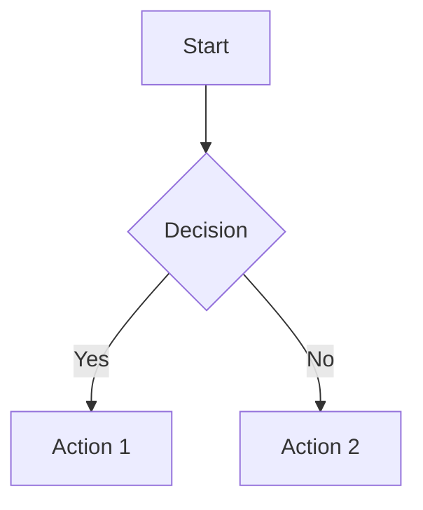

# Peter Markdown Test Fixture

This file is used for unit testing the markdown parser and renderer.

## Text Formatting

This is **bold text**, *italic text*, ~~strikethrough~~, and `inline code`.

## Lists

### Unordered List

- Item 1
- Item 2
  - Nested Item 2.1
  - Nested Item 2.2
- Item 3

### Ordered List

1. First item
2. Second item
3. Third item

### Task List

- [x] Completed task
- [ ] Incomplete task
- [ ] Another task

## Blockquotes

> This is a blockquote.
> It can span multiple lines.
>
> > Nested blockquote

## Code Blocks

```javascript
function hello(name) {
  console.log(`Hello, ${name}!`);
  return true;
}
```

```python
def fibonacci(n):
    if n <= 1:
        return n
    return fibonacci(n-1) + fibonacci(n-2)
```

## Tables

| Name  | Age | City     |
|-------|-----|----------|
| Alice | 30  | New York |
| Bob   | 25  | London   |
| Carol | 35  | Tokyo    |

## Links and Images

[Visit GitHub](https://github.com)


## Footnotes

Here is a footnote reference[^1] and another[^2].

[^1]: First footnote text.
[^2]: Second footnote text.

## Horizontal Rule

---

## HTML Inline

<p style="color: red;">This HTML should be preserved.</p>

## Mathematical Formula (Phase 2)

When $a \ne 0$, there are two solutions to $(ax^2 + bx + c = 0)$ and they are:

$$ x = {-b \pm \sqrt{b^2-4ac} \over 2a} $$

## Mermaid Diagram (Phase 2)



## Special Characters

Special chars: &lt; &gt; &amp; &quot; &apos;

## Multiple Consecutive Empty Lines (stress test)


End of file.